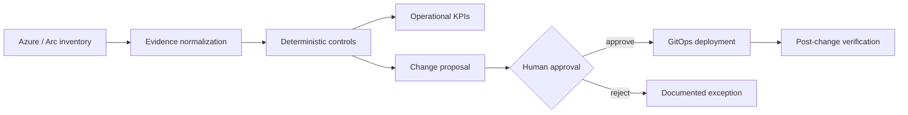

# Azure Managed Services Platform

Multi-tenant Azure and hybrid-cloud operations for MSPs using **Azure Lighthouse, Azure Arc,
Azure Monitor, Azure Policy, Bicep, Terraform/OpenTofu, GitOps, FinOps and review-gated
remediation**.

[A2Z SOC](https://a2zsoc.com) · [Architecture](docs/architecture.md) ·
[Controls](docs/control-catalog.md) · [Service catalog](docs/service-catalog.md)

## Why this exists

Azure customers do not need another static architecture diagram. They need an operating system
that turns fragmented inventory, alerts, patch posture, backup coverage, networking exposure and
cost recommendations into approved, testable work with a measurable result.

This repository is the integration plane for that operating model. It currently provides:

- a customer-revocable Azure Lighthouse onboarding template;
- a deliberately small Azure Monitor customer baseline;
- a dependency-free Python control evaluator;
- deterministic operational KPIs;
- review-gated change proposals with validation and rollback contracts;
- synthetic fixtures and tests that do not misrepresent a live Azure deployment.

## Demonstrated workflow



## Run the offline proof

No Azure account is required for the synthetic evaluation:

```bash
python -m venv .venv
source .venv/bin/activate
python -m pip install -e '.[dev]'
pytest -q
azure-msp examples/customer-inventory.json --output evidence/report.json
```

For a dependency-free smoke test:

```bash
PYTHONPATH=src python tests/run_smoke.py
PYTHONPATH=src python -m azure_msp.cli examples/customer-inventory.json --output evidence/report.json
```

The fixture intentionally contains an unmonitored VM, a stale patch assessment, incomplete
ownership and a publicly reachable storage account. The engine emits findings and proposals but
executes **zero** cloud changes.

## Azure deployment building blocks

Validate before deploying:

```bash
az bicep build --file infra/lighthouse/main.bicep
az bicep build --file infra/customer-baseline/main.bicep
```

The Lighthouse template defaults to Reader. Production authorization must be decomposed by job
function and approved by the customer. The baseline uses public Log Analytics endpoints so it can
remain small and comprehensible; regulated deployments should evaluate Private Link, data
residency, retention and customer-managed encryption requirements.

## KPI contract

The initial executable KPIs are:

- resource ownership coverage;
- VM monitoring coverage;
- VM backup coverage;
- findings by severity;
- open review-gated proposals;
- automatically executed changes, which is intentionally zero.

Production service KPIs extend to availability, MTTA/MTTR, patch compliance, tested restore rate,
change failure rate, drift age, forecast accuracy, verified savings and automation rollback rate.

## Product boundaries

This is production-oriented source code, not proof that a production service is operating. The
repository does **not** claim customer deployments, 24x7 coverage, compliance certification,
guaranteed savings or autonomous remediation. Live portal and CLI evidence will be added only
after an authorized Azure tenant is available.

## Roadmap

1. Azure Resource Graph and Policy Insights adapters with provenance receipts
2. Lighthouse-based multi-customer inventory isolation
3. Update Manager, Backup, Service Health and Cost Management adapters
4. Customer approval portal and durable workflow orchestration
5. Terraform/OpenTofu and Bicep change generation behind deterministic gates
6. Marketplace Managed Service offer packaging
7. Azure Arc lab for a Linux server outside Azure
8. Live restore, incident and cost-optimization evidence

## License

Apache-2.0. Commercial managed services, support and customer-specific integrations are available
through [A2Z SOC](https://a2zsoc.com).
