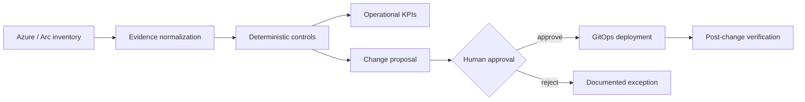

# Azure Managed Services Platform

Multi-tenant Azure and hybrid-cloud operations for MSPs using **Azure Lighthouse, Azure Arc,
Azure Monitor, Azure Policy, Bicep, Terraform/OpenTofu, GitOps, FinOps and review-gated
remediation**.

[A2Z SOC](https://a2zsoc.com) · [Architecture](docs/architecture.md) ·
[Controls](docs/control-catalog.md) · [Recovery assurance](docs/recovery-assurance.md) ·
[Change assurance](docs/change-assurance.md) ·
[Incident revenue protection](docs/incident-revenue-protection.md) ·
[FinOps value realization](docs/finops-value-realization.md) ·
[Migration and modernization](docs/migration-modernization-factory.md) ·
[AI production engineering](docs/ai-production-engineering.md) ·
[Network digital twin](docs/network-digital-twin.md) ·
[Data reliability](docs/data-reliability.md) ·
[Capacity engineering](docs/capacity-performance.md) ·
[Commercial control plane](docs/commercial-control-plane.md) ·
[AI unit economics](docs/ai-unit-economics-gateway.md) ·
[Service catalog](docs/service-catalog.md)

## Why this exists

Azure customers do not need another static architecture diagram. They need an operating system
that turns fragmented inventory, alerts, patch posture, backup coverage, networking exposure and
cost recommendations into approved, testable work with a measurable result.

This repository is the integration plane for that operating model. It currently provides:

- a customer-revocable Azure Lighthouse onboarding template;
- a deliberately small Azure Monitor customer baseline;
- a dependency-free Python control evaluator;
- deterministic operational KPIs;
- review-gated change proposals with validation and rollback contracts;
- business-service grouping and financial-exposure prioritization;
- tenant-bound approval state transitions with audit events;
- a responsive customer-facing HTML operations report;
- an opt-in, read-only Azure CLI acquisition adapter for five evidence sources;
- evidence receipts containing scope, timestamps, query identity, adapter version and hashes;
- recovery contracts, dependency ordering, RTO/RPO evaluation and drill economics;
- progressive infrastructure-change gates using workload health and financial intent;
- incident signal correlation, recovery authority and transaction-based restoration proof;
- workload cost allocation, unit economics and approval-gated optimization decisions;
- an intentionally empty verified-savings ledger until post-change billing proves value;
- dependency-aware 6R migration assessment, cutover gates and protected decommissioning;
- multi-provider AI release economics, loop detection and evidence-gated model selection;
- hybrid and multi-cloud connectivity intents with current/proposed path comparison;
- semantic data contracts, lineage blast radius and evidence-gated publication;
- forecast-driven cross-stack capacity portfolios with quota and load-test gates;
- contract-driven tenant lifecycle, isolation, entitlement and Marketplace revenue gates;
- trace-to-outcome AI cost allocation, retry-waste detection and review-gated model routing;
- synthetic fixtures and tests that do not misrepresent a live Azure deployment.

## Demonstrated workflow



## Run the offline proof

No Azure account is required for the synthetic evaluation:

```bash
python -m venv .venv
source .venv/bin/activate
python -m pip install -e '.[dev]'
pytest -q
azure-msp examples/customer-inventory.json --output evidence/report.json
```

For a dependency-free smoke test:

```bash
PYTHONPATH=src python tests/run_smoke.py
PYTHONPATH=src python -m azure_msp.cli examples/customer-inventory.json \
  --output evidence/report.json \
  --html evidence/customer-report.html
```

Open `evidence/customer-report.html` locally to inspect the customer operations view. The displayed
revenue and exposure values are synthetic prioritization inputs, not validated customer losses.

## Authorized live collection

The collection command requires an explicit acknowledgement and performs read operations only:

```bash
azure-msp-collect \
  --tenant-id 00000000-0000-0000-0000-000000000000 \
  --subscription-id 00000000-0000-0000-0000-000000000000 \
  --acknowledge-authorized-read \
  --output evidence/live-baseline.json
```

It attempts Azure Resource Graph, Policy Insights, Advisor, Resource Health and RBAC observations.
Unavailable permissions or services are recorded as `unknown`; they are never treated as passing
controls. The command does not deploy, update or delete Azure resources. Authenticate separately
with the Azure CLI and use only a tenant and subscription you are authorized to assess.

## Recovery assurance proof

Replay the synthetic recovery drill:

```bash
PYTHONPATH=src python -m azure_msp.recovery_cli \
  examples/recovery-contract.json \
  examples/recovery-drill-events.json \
  --isolated-network \
  --approval workload-owner \
  --approval cloud-operations \
  --output evidence/recovery-report.json
```

The fixture deliberately breaches RTO and RPO and fails its synthetic checkout transaction. It
therefore demonstrates failure detection, not successful Azure recoverability. The engine rejects
missing approvals, non-isolated drills, prohibited production failover and dependency cycles.

## Change assurance proof

Replay a synthetic Azure database-downsizing rollout:

```bash
PYTHONPATH=src python -m azure_msp.change_cli \
  examples/change-contract.json \
  examples/change-observations.json \
  --approval workload-owner \
  --approval cloud-operations \
  --approval financial-owner \
  --output evidence/change-report.json
```

The test ring passes. The canary breaches latency, error-rate and transaction-success thresholds,
so production promotion is halted, rollback is required and the proposed saving remains unrealized.
This replay does not execute an infrastructure deployment.

## Incident revenue-protection proof

Replay the synthetic checkout incident caused by the rejected database downsizing:

```bash
PYTHONPATH=src python -m azure_msp.incident_cli \
  examples/incident-contract.json \
  examples/incident-evidence.json \
  --action rollback_deployment \
  --approval workload-owner \
  --approval cloud-operations \
  --output evidence/incident-report.json
```

Four raw signals collapse into three symptoms. Read-only diagnostic evidence identifies the linked
database change, and the synthetic rollback observation restores checkout health in 18 minutes.
The reported margin exposure is an estimate; verified financial loss remains unknown. The replay
authorizes but does not execute the rollback, and reports zero cloud mutations.

The fixture intentionally contains an unmonitored VM, a stale patch assessment, incomplete
ownership and a publicly reachable storage account. The engine emits findings and proposals but
executes **zero** cloud changes.

## FinOps value-realization proof

Replay synthetic Azure cost and workload-demand evidence:

```bash
PYTHONPATH=src python -m azure_msp.finops_cli \
  examples/finops-evidence.json \
  --approval workload-owner \
  --approval financial-owner \
  --approval cloud-operations \
  --output evidence/finops-report.json
```

The replay allocates shared monitoring and gateway costs, calculates cost per successful
transaction and evaluates three optimization options. Unsafe database downsizing is rejected.
Eligible options still require Change Assurance, and the verified-savings ledger remains empty
until normalized post-change billing evidence exists. No Azure changes are executed.

## Migration and modernization proof

Replay a synthetic VMware-to-Azure migration wave:

```bash
PYTHONPATH=src python -m azure_msp.migration_cli \
  examples/migration-evidence.json \
  --approval application-owner \
  --approval cloud-operations \
  --approval business-owner \
  --output evidence/migration-report.json
```

The dependency order places SQL before the checkout API and web tier. The API fails DNS and
business-transaction validation, so the complete wave is blocked. The report compares 6R target
candidates but treats its recommendation as decision support. Source decommissioning always
requires a separate approval, and the replay executes zero cloud mutations.

## AI production engineering proof

Compare synthetic Microsoft Foundry, NVIDIA NIM, self-hosted and frontier-model candidates:

```bash
PYTHONPATH=src python -m azure_msp.ai_production_cli \
  examples/ai-release-evidence.json \
  --approval product-owner \
  --approval ai-operations \
  --approval financial-owner \
  --output evidence/ai-release-report.json
```

The inexpensive self-hosted candidate is rejected because completion, quality, groundedness, tool
correctness, loops and net contribution regress. The highest-value eligible candidate advances
only to shadow evaluation. Production promotion remains unauthorized and zero cloud changes run.

## Network digital-twin proof

Evaluate a synthetic Terraform network change before deployment:

```bash
PYTHONPATH=src python -m azure_msp.network_cli \
  examples/network-change-evidence.json \
  --approval network-owner \
  --approval application-owner \
  --approval cloud-operations \
  --output evidence/network-report.json
```

The proposed state sends checkout traffic to a wrong next hop, resolves a private SQL endpoint
publicly and loses the DR return route. The change is blocked, the responsible controls remain in
the evidence report and production deployment is not authorized. No cloud mutation is executed.

## Data reliability proof

Evaluate a synthetic Salesforce-to-Fabric data release:

```bash
PYTHONPATH=src python -m azure_msp.data_cli \
  examples/data-release-evidence.json \
  --approval data-owner \
  --approval revenue-operations \
  --approval data-platform \
  --output evidence/data-report.json
```

The pipeline technically succeeds, but a dollars-to-cents semantic change violates type, unit,
range and reconciliation contracts. Publication and automated decisions are blocked; downstream
Power BI, forecasting, inventory and agent consumers are listed. No data mutation is executed.

## Capacity and performance proof

Evaluate a synthetic product-launch capacity plan:

```bash
PYTHONPATH=src python -m azure_msp.capacity_cli \
  examples/capacity-plan-evidence.json \
  --approval product-owner \
  --approval capacity-engineering \
  --approval financial-owner \
  --output evidence/capacity-report.json
```

The AKS-only plan is rejected because database, NAT, NIM, DR and quota constraints remain. A
full-dependency pre-scale portfolio is eligible only for an isolated load test. Production scaling
is not authorized and no cloud mutation is executed.

## SaaS commercial control-plane proof

Evaluate a synthetic regulated-customer onboarding and invoice:

```bash
PYTHONPATH=src python -m azure_msp.commercial_cli \
  examples/commercial-onboarding-evidence.json \
  --approval commercial-owner \
  --approval cloud-operations \
  --approval financial-owner \
  --output evidence/commercial-report.json
```

The shared and wrong-region offers are rejected. The dedicated West Europe stamp clears the
isolation, entitlement and margin contracts; duplicate usage is excluded and the invoice
reconciles. The result is a plan only: no tenant activation, provisioning, billing submission or
cloud mutation is executed.

## AI unit economics proof

Evaluate synthetic Azure OpenAI and NVIDIA NIM outcome traces:

```bash
PYTHONPATH=src python -m azure_msp.ai_value_cli \
  examples/ai-value-evidence.json \
  --approval product-owner \
  --approval ai-operations \
  --approval financial-owner \
  --output evidence/ai-value-report.json
```

The report allocates model, GPU, tool and shared-platform cost to tenants and workflows, exposes
the cost of a rejected retry, and evaluates routing candidates against quality, latency, region
and approval contracts. The eligible NVIDIA NIM option is authorized only for a shadow test;
production routing remains unchanged and the verified-savings ledger remains empty.

## Azure deployment building blocks

Validate before deploying:

```bash
az bicep build --file infra/lighthouse/main.bicep
az bicep build --file infra/customer-baseline/main.bicep
```

The Lighthouse template defaults to Reader. Production authorization must be decomposed by job
function and approved by the customer. The baseline uses public Log Analytics endpoints so it can
remain small and comprehensible; regulated deployments should evaluate Private Link, data
residency, retention and customer-managed encryption requirements.

## KPI contract

The initial executable KPIs are:

- resource ownership coverage;
- VM monitoring coverage;
- VM backup coverage;
- findings by severity;
- open review-gated proposals;
- automatically executed changes, which is intentionally zero.

Production service KPIs extend to availability, MTTA/MTTR, patch compliance, tested restore rate,
change failure rate, drift age, forecast accuracy, verified savings and automation rollback rate.

## Product boundaries

This is production-oriented source code, not proof that a production service is operating. The
repository does **not** claim customer deployments, 24x7 coverage, compliance certification,
guaranteed savings or autonomous remediation. Live portal and CLI evidence will be added only
after an authorized Azure tenant is available.

## Roadmap

1. Azure Resource Graph and Policy Insights adapters with provenance receipts
2. Lighthouse-based multi-customer inventory isolation
3. Update Manager, Backup, Service Health and Cost Management adapters
4. Customer approval portal and durable workflow orchestration
5. Terraform/OpenTofu and Bicep change generation behind deterministic gates
6. Marketplace Managed Service offer packaging
7. Azure Arc lab for a Linux server outside Azure
8. Live restore, incident and cost-optimization evidence

## License

Apache-2.0. Commercial managed services, support and customer-specific integrations are available
through [A2Z SOC](https://a2zsoc.com).
