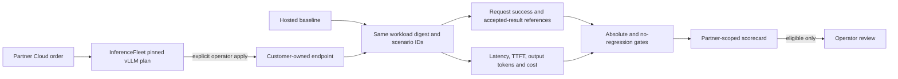

# AI Service Operator: paired endpoint decision

AI Service Operator is the first measurable loop for operating customer-owned inference endpoints. It connects a [Partner Cloud](private-ai-partner-cloud.md) order and [InferenceFleet](inference-fleet.md) deployment plan to a paired, scenario-level comparison against a hosted baseline. The first release evaluates imported benchmark evidence and records an authenticated partner scorecard. It does not generate traffic, change routing, deploy a cluster, or verify acceptance labels independently.



## Comparison contract

The contract pins one workload SHA-256, the partner order, minimum request count, success and acceptance floors, p95 latency and time-to-first-token ceilings, and a maximum cost per accepted result. Each run must include exactly the same unique scenario IDs. The importer accepts **metrics and acceptance references only**; it rejects additional event fields such as prompts or customer text. An accepted result must be a successful request and include a reference to the human or evaluator decision. Those references are assertions until independently reviewed.

Cost for the **whole test window** is:

`GPU hours × GPU-hour USD + other fixed USD + sum(request cost USD)`

`Cost per accepted result = whole-window cost ÷ accepted results`

The calculation includes idle GPU time declared in the test window. It does not infer rates from token counts. Count any hosted API charge as request cost; count any dedicated GPU bill under GPU hours, and avoid entering the same expense twice. The importer uses decimal arithmetic and compares unrounded values against policy; displayed USD is rounded to four decimals. A run with zero accepted results has unknown unit cost and cannot pass. P95 uses the nearest-rank method over successful requests.

The candidate is eligible for operator review only when it meets every absolute target, has at least as many accepted results as the matched baseline, and has no higher cost per accepted result. Eligibility is **not** an instruction to move production traffic. A partner score can be recorded only against an existing order for the same partner and candidate model.

## Synthetic proof

The included three-scenario fixture is intentionally too small for a production release decision. It illustrates paired accounting: baseline cost $0.36 for two accepted results ($0.18 each); candidate cost $0.15 for three accepted results ($0.05 each). These are fictional numbers.

```bash
azure-msp-ai-service evaluate \
  examples/ai-service-contract.synthetic.json \
  examples/ai-service-benchmark.synthetic.json \
  --output evidence/ai-service-score.json
```

For an actual partner order, first create a pinned deployment plan with `azure-msp-ai-service plan --db /private/path/partner.sqlite --partner-id partner-a --order-id ord-REPLACE --spec /private/path/fleet-spec.json --output /private/path/fleet-plan.json`. This reuses InferenceFleet's one-GPU planner; the operator-approved `azure-msp-inference-fleet apply` command is still separate. Run the same consented workload against both endpoints using an external load generator, keep the raw results privately, attach acceptance references, and import the aggregate event metrics. With a matching Partner Cloud order, add `--db /private/path/partner.sqlite` to `evaluate` to record the score. The partner can then retrieve only its order's scorecards using `AZURE_MSP_PARTNER_TOKEN` and:

```bash
azure-msp-ai-service scores --db /private/path/partner.sqlite \
  --partner-id partner-a --order-id ord-REPLACE
```

The CLI remains local. The scorecard does not confer customer identity, SLA coverage, an invoice, or a deployed endpoint.

## Commercial release gates

1. One authorized customer-owned GPU deployment with a pinned image/model and documented rollback; compare it with the customer's current endpoint on an adequately sized, representative cohort.
2. Collect endpoint requests, token usage, GPU-hours, cloud billing and acceptance decisions through reproducible adapters; reconcile total measured cost with the cloud bill and investigate gaps.
3. Add ongoing alerting and operator ownership, a security-reviewed customer portal, usage and cost caps, and documented response times before charging for a managed SLA.
4. Repeat the pilot with an independent customer and measure acceptance-rate stability, p95 latency, cost per accepted result, operator hours and contribution after cloud costs. Only then test multi-model or multi-cloud optimization.

Existing serving systems remain the execution layer. The differentiation to validate is whether an operator can consistently improve the customer's accepted work per dollar while meeting service targets.
