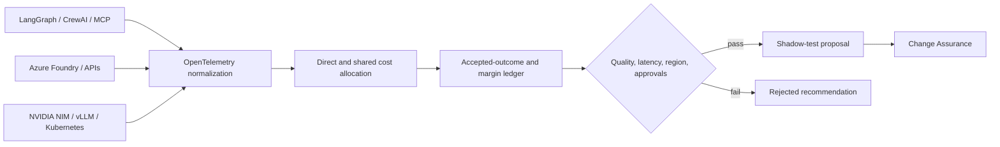

# OpenTelemetry AI unit economics gateway

This module connects AI execution evidence to business and tenant economics. It is a deterministic
reference core for an OpenTelemetry Collector processor, not a claim that synthetic traces prove
production savings.

## Evidence path

The evaluator rejects duplicate events and missing rate cards, allocates shared platform cost by
token volume, and calculates cost per accepted outcome, retry/rejection waste, evaluation pass
rate, p95 latency and tenant gross margin. A routing candidate must satisfy region, quality,
latency, reversibility and approval contracts. Passing creates a shadow-test proposal only.

## Production adapters

- OpenTelemetry GenAI spans and an OpenTelemetry Collector processor
- Azure Monitor, Application Insights and Microsoft Foundry evaluations
- NVIDIA NIM, DCGM, Prometheus, Kubernetes and OpenCost
- LangChain, LangGraph, CrewAI, MCP, n8n and API gateways
- Azure Cost Management exports and customer billing systems
- Terraform/OpenTofu, Bicep, Helm and the platform Change Assurance workflow

## KPIs

- AI spend allocated to an owner and business outcome
- Cost per accepted outcome and gross margin by tenant
- Retry and rejected-workflow waste
- Evaluation pass rate, p95 latency and time to first token
- GPU utilization, idle cost and capacity saturation
- Forecast-to-actual variance and unbilled usage
- Shadow-test win rate, rollback rate and independently verified savings

## Commercial boundary

Indicative positioning ranges are USD 7,500–20,000 for discovery, USD 20,000–60,000 for an
instrumentation pilot, USD 75,000–250,000 for production implementation and USD 8,000–35,000
monthly for managed AI ValueOps. Consumption, licenses and third-party assurance are excluded.
Prices and savings require customer-specific discovery and are not guarantees.
