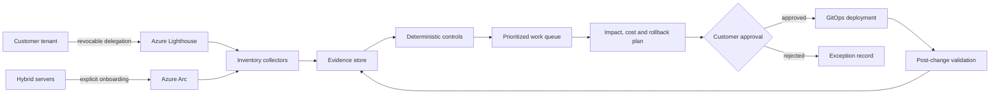

# Architecture and trust boundaries

## Operating model

The platform separates customer authority, observation, decision and execution.

## Trust rules

1. The customer owns its tenant, data and approval authority.
2. Lighthouse delegation is scoped and customer-revocable.
3. Collection is read-only by default.
4. Evidence records their source and collection time.
5. Recommendations cannot directly execute cloud mutations.
6. Changes require a reviewed IaC artifact, approval, validation and rollback plan.
7. AI-generated explanations never override deterministic authorization.
8. Cross-customer data is logically and cryptographically separated.
9. Operational evidence is retained only for the contracted period.
10. Provider activity is auditable by the customer.

## Production extensions

- Workload identity federation for automation
- Private ingestion and query paths where justified
- Customer-managed keys for regulated workloads
- Azure Monitor Private Link Scope
- Durable work queue and idempotent workers
- Managed identity instead of stored credentials
- Azure Resource Graph inventory adapter
- Azure Policy Insights adapter
- Update Manager and Backup adapters
- Service Health and Cost Management adapters
- Ticketing integration and customer approval portal
- OpenTelemetry traces with customer-specific sampling and retention

## Explicit non-goals for v0.1

- Autonomous remediation
- 24x7 SOC or NOC coverage
- Compliance certification
- Guaranteed cloud savings
- A production SLA

