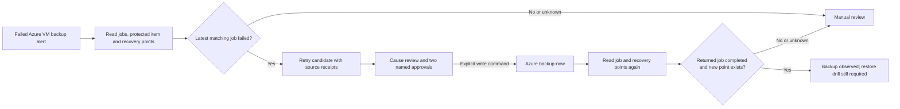

# Backup Resolution workcell

The first A2Z Resolution Cloud workflow handles one Azure IaaS VM protected by one Recovery Services vault. It collects four read-only observations, proposes a controlled on-demand backup retry when the latest matching job failed, requires operator review and two named approvals before retry, and checks for the returned job ID plus a new recovery point afterward. The included replay is synthetic. **No customer Azure tenant or backup job was accessed during development.**



## Reproduce the synthetic path

```bash
azure-msp-backup-resolution plan \
  --snapshot examples/backup-resolution-before.synthetic.json \
  --output /tmp/backup-resolution-plan.json

azure-msp-backup-resolution verify \
  --before examples/backup-resolution-before.synthetic.json \
  --after examples/backup-resolution-after.synthetic.json \
  --attempt examples/backup-resolution-attempt.synthetic.json \
  --output /tmp/backup-resolution-outcome.json
```

The fixture has a failed job, a reviewed retry whose returned job ID later completes, and a new recovery point. Removing that point or changing the job ID makes verification fail. A new point is evidence that a backup was produced, **not proof that the VM can be restored**. Use [Recovery Assurance](recovery-assurance.md) for an isolated restore drill.

## Authorized Azure pilot runbook

Copy `examples/backup-resolution-scope.template.json` to private storage and replace every value with the exact authorized tenant, subscription, vault, resource group and VM. Authenticate Azure CLI separately. The collector checks that `az account show` returns the specified tenant and subscription before treating any backup evidence as observed. Store snapshots and receipts in private storage because they contain customer resource identifiers.

```bash
azure-msp-backup-resolution collect \
  --scope /private/path/backup-scope.json \
  --output /private/path/before.json \
  --acknowledge-authorized-read

azure-msp-backup-resolution plan \
  --snapshot /private/path/before.json \
  --output /private/path/plan.json
```

The collector uses `az account show`, `az backup job list`, `az backup item show`, and `az backup recoverypoint list` with an explicit subscription. A scope mismatch or failed read becomes `unknown` and cannot authorize retry. The plan identifies the failed job and proposes `backup_now_candidate`; it **does not diagnose root cause**. Review the error code, VM agent state, vault status, retention and any relevant [Azure Backup troubleshooting guidance](https://learn.microsoft.com/en-us/azure/backup/backup-azure-vms-troubleshoot). Document why retry is reasonable before the write command.

```bash
azure-msp-backup-resolution retry \
  --scope /private/path/backup-scope.json \
  --before /private/path/before.json \
  --plan /private/path/plan.json \
  --approval workload-owner --approval backup-operator \
  --cause-reviewed --acknowledge-cloud-write \
  --output /private/path/attempt.json
```

`retry` re-reads the vault immediately before invoking `az backup protection backup-now` and refuses if the latest failed job changed. It makes **one cloud write**. The approval flags are operator declarations, not authenticated approval records; a production service needs integration with identity, ticket approval and audit systems. If Azure CLI fails, the result is `unknown` because the command may have reached Azure. Do not blindly repeat it.

After the job finishes, run the read-only `collect` command again to save `/private/path/after.json`, then run `verify` with the before, after and attempt files. Verification requires the exact returned job ID to report `Completed` and a new recovery point created after the retry started. It reports `unknown` if Azure did not return a job ID. A missing point or failed job remains unverified.

The CLI arguments follow Microsoft's [Azure Backup job](https://learn.microsoft.com/en-us/cli/azure/backup/job), [recovery point](https://learn.microsoft.com/en-us/cli/azure/backup/recoverypoint), and [backup-now](https://learn.microsoft.com/en-us/cli/azure/backup/protection) documentation. Azure CLI output can vary by version; validate the adapter on a nonproduction protected VM before handling a live incident.

## Pilot acceptance and commercial boundary

For one consenting customer, measure alert-to-diagnosis time, operator minutes, repeat attempts, backup job completion, new-point creation, 30-day recurrence and cost per verified backup. A paid managed service additionally needs authenticated approvers, safe retry quotas, alert ingestion, job polling, incident escalation, on-call ownership, change records and an isolated restore drill. None of those are represented as completed here. The first release neither restores a VM nor certifies recoverability.
