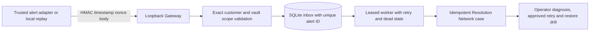

# Customer Operations Gateway: first single-customer slice

The Gateway adds authenticated alert intake and durable delivery to the existing [Production Resolution Operator](production-resolution-operator.md). The current runtime is a **local single-customer installation** with a loopback HMAC endpoint and SQLite queue. It does not yet receive Azure Monitor secure webhooks directly, use Azure Service Bus, or provide a hosted customer portal. Incoming alerts only open cases; they cannot trigger Azure writes.



The first customer database is bound to a hash of its customer ID, exact Azure scope and workcell recipe. Reusing that database with another customer configuration fails. Intake accepts at most 64 KiB, verifies HMAC-SHA256 over `timestamp.nonce.body`, restricts the timestamp to a five-minute window, and stores each nonce to block replay. An alert ID with identical bytes returns the original message; the same ID with a different body is rejected. The case worker uses a lease and up to five attempts. If it crashes after opening a case but before acknowledging the message, the case ledger's alert-ID uniqueness makes reprocessing idempotent.

The HMAC key must be a random value of at least 32 characters, stored outside this repository. The built-in HTTP server binds only to a loopback IP. It is **not** a public Azure Monitor endpoint and should not be exposed by a generic proxy. Azure Monitor's secure webhook uses Microsoft Entra authentication, so a separate authenticated transport adapter is required before routing live customer alerts into this queue. [Azure Monitor action groups](https://learn.microsoft.com/en-us/azure/azure-monitor/alerts/action-groups) documents the secure webhook path.

## Reproduce the local workflow

Set a random `AZURE_MSP_GATEWAY_HMAC_KEY` in your shell. Keep the database outside a public checkout. The following fixture is synthetic:

```bash
azure-msp-customer-gateway --db /private/path/gateway.sqlite3 \
  --config examples/customer-gateway.synthetic.json \
  enqueue-file examples/backup-alert.synthetic.json

azure-msp-customer-gateway --db /private/path/gateway.sqlite3 \
  --config examples/customer-gateway.synthetic.json work-once

azure-msp-customer-gateway --db /private/path/gateway.sqlite3 \
  --config examples/customer-gateway.synthetic.json status
```

`work-once` prints the case ID. Use `azure-msp-production-resolution --db /private/path/gateway.sqlite3 show CASE_ID` to see its state, then the operator's read-only `diagnose` command. For an HMAC-authenticated local HTTP test, run `serve --host 127.0.0.1 --port 8173` after the same global `--db` and `--config` arguments. No mutation command is exposed by the Gateway.

## Azure installation foundation

[`infra/customer-gateway/queue.bicep`](../infra/customer-gateway/queue.bicep) provisions a Standard Service Bus namespace and a queue with one-day duplicate detection, five deliveries, and dead lettering. The template is a **foundation for the next transport adapter**; the current worker does not connect to it. Deploying it creates chargeable Azure resources and requires a chosen subscription, resource group, namespace name, permissions and budget. The template has not been validated in a customer subscription.

For a real pilot, add an Entra-protected ingress service for the Azure Monitor secure webhook, publish validated alerts to Service Bus with the alert ID as `MessageId`, and run a managed-identity worker in the customer's environment. Keep the idempotent case key even when Service Bus duplicate detection is enabled, since its duplicate window is finite. Restrict queue roles, protect evidence storage, record operator identity, monitor the dead-letter queue, and test recovery after worker interruption. Azure Lighthouse delegation can support customer-revocable provider access; onboarding still requires action in the customer's tenant. [Service Bus duplicate detection](https://learn.microsoft.com/en-us/azure/service-bus-messaging/duplicate-detection), [Azure Lighthouse onboarding](https://learn.microsoft.com/en-us/azure/lighthouse/how-to/onboard-customer).

The first acceptance test is one consented customer alert delivered through the installed secure adapter, one case, zero duplicate writes, a verified new recovery point, an isolated restore drill, and measured operator time and cost. None of those live-customer results are claimed by this local release.
