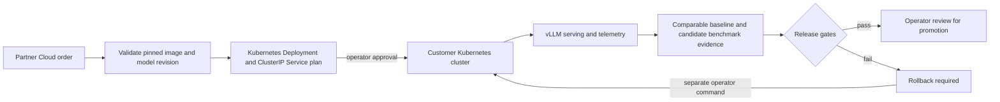

# InferenceFleet: first executable slice

InferenceFleet connects a Partner Cloud order to a pinned, namespaced, single-GPU vLLM deployment plan and a measured release decision. The operator can explicitly apply the plan or undo a bad rollout with `kubectl`. This is a **first workload operator**, not an autonomous fleet manager. The included benchmark is synthetic; no customer cluster or paid GPU was accessed during development.



## Workflow

Create an order with [Private AI Partner Cloud](private-ai-partner-cloud.md). Copy `examples/inference-fleet-spec.template.json` to a private location and replace both placeholders with a tested vLLM image digest and exact model commit SHA. Prepare the namespace, GPU node, `model-cache` PVC and `hf-read-token` Secret in the customer's cluster. The repository does not create credentials or select a GPU on the customer's behalf. Confirm the model license, image compatibility, cache permissions and GPU memory before applying.

```bash
azure-msp-inference-fleet plan --db /private/path/partner.sqlite \
  --partner-id partner-a --order-id ord-REPLACE \
  --spec /private/path/fleet-spec.json --output /private/path/fleet-plan.json

azure-msp-inference-fleet apply --plan /private/path/fleet-plan.json \
  --namespace customer-inference --context CUSTOMER_CONTEXT \
  --acknowledge-cluster-write
```

`plan` writes a Kubernetes JSON `List` with one `Deployment` and one internal `ClusterIP` `Service`. It does not contact the cluster. `apply` calls `kubectl` against the named context and namespace, and therefore **changes that cluster**. Its acknowledgement flag is intentionally separate from generating a plan. The `Deployment` keeps two revisions and allows one surge pod, so an update needs capacity for **two GPUs** even though steady state uses one. This first release has no ingress, public endpoint, autoscaler, canary traffic split or secret provisioning. Run a cluster rollout and endpoint check before activating the partner order.

Import a baseline and candidate benchmark measured under comparable workload and hardware conditions. Both entries must declare the same workload SHA-256 and GPU profile; these are supplied claims, not independently verified by this release. The JSON also contains request count, success rate, p95 latency, p95 time to first token, output tokens, GPU hours and GPU-hour cost. The evaluator calculates `GPU hours × GPU-hour cost × 1,000,000 / output tokens`. This is **GPU cost only**; storage, networking, licenses, support, power and overhead are excluded. The source and measurement method must be reviewed outside this tool.

```bash
azure-msp-inference-fleet evaluate \
  --evidence examples/inference-fleet-benchmark.synthetic.json \
  --output /private/path/release-decision.json
```

The included fixture fails success, latency, TTFT and cost gates. A failing evaluation outputs `rollback_required`; it does not mutate the cluster. If an operator confirms that the decision corresponds to the active release, the following command invokes `kubectl rollout undo`. Kubernetes must still have a working previous revision.

```bash
azure-msp-inference-fleet rollback --decision /private/path/release-decision.json \
  --namespace customer-inference --context CUSTOMER_CONTEXT \
  --acknowledge-cluster-write
```

An eligible result means **operator review**, not automatic promotion. The first real-pilot acceptance test is one authorized order, a pinned deployment on a customer-controlled GPU cluster, a reproducible baseline/candidate benchmark, a failed update recovered by rollback, and a verified endpoint handed back to Partner Cloud. Record deployment reference, signed contract reference and HTTPS origin through the Partner Cloud activation command only after those checks.

## Next production increments

1. Integrate a reproducible, bounded load generator and signed benchmark provenance; currently measurements are imported JSON.
2. Add workload-level Prometheus/vLLM metrics, customer traffic quality tests, incident alerting and billable usage reconciliation.
3. Add a real canary route with weighted traffic, then capacity-aware autoscaling and multi-GPU profiles using existing serving stacks such as KServe or llm-d.
4. Add continuous reconciliation, audit logs, identity integration, backup and disaster recovery before claiming managed production service.
