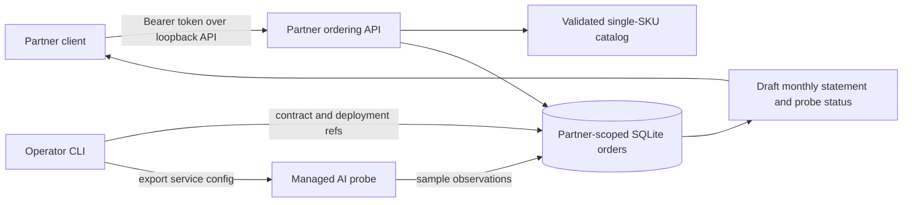

# Private AI Partner Cloud: one-partner pilot

This is a runnable, local-first ordering slice for one private inference SKU. A partner can view a fixed catalog, submit a customer order, read only its own orders, and retrieve draft monthly contract-price statements. An operator separately confirms a signed contract and deployment reference, then activates the order and exports the service definition used by [Managed AI Operations](managed-ai-operations.md). The example model, prices, region and customer names are **fictional**. There is no live partner, customer deployment, payment flow or contractual SLA in this repository.



## Run a local demonstration

Install the package with `python -m pip install -e .` or prefix the commands with `PYTHONPATH=src python -m azure_msp.partner_cloud_cli`. Store the database, partner token and exported service file outside the public repository.

```bash
export PARTNER_CLOUD_BOOTSTRAP_TOKEN="$(python3 -c 'import secrets; print(secrets.token_urlsafe(48))')"
azure-msp-partner-cloud register-partner --db /private/path/partner.sqlite --partner-id partner-a
azure-msp-partner-cloud serve --db /private/path/partner.sqlite \
  --catalog examples/private-ai-partner-sku.json
```

From another terminal, supply the generated token through a protected environment variable or secret manager:

```bash
curl -H 'X-Partner-ID: partner-a' \
  -H "Authorization: Bearer $PARTNER_CLOUD_BOOTSTRAP_TOKEN" \
  http://127.0.0.1:8765/v1/catalog
curl -X POST -H 'X-Partner-ID: partner-a' \
  -H "Authorization: Bearer $PARTNER_CLOUD_BOOTSTRAP_TOKEN" \
  -H 'Content-Type: application/json' \
  --data '{"customer_id":"pilot-customer","sku":"private-inference-1gpu","region":"customer-private-cloud"}' \
  http://127.0.0.1:8765/v1/orders
```

The operator should activate only after independently checking the signed contract and actual deployment. An order cannot activate twice. The CLI writes the service definition separately, so it can be regenerated if the file write fails.

```bash
azure-msp-partner-cloud activate --db /private/path/partner.sqlite \
  --order-id ord-REPLACE --deployment-ref approved-deployment-REPLACE \
  --contract-ref signed-contract-REPLACE --endpoint-url https://ai.example.invalid
azure-msp-partner-cloud service-config --db /private/path/partner.sqlite \
  --partner-id partner-a --order-id ord-REPLACE --output /private/path/service.json
azure-msp-managed-ai probe /private/path/service.json --db /private/path/partner.sqlite
curl -H 'X-Partner-ID: partner-a' \
  -H "Authorization: Bearer $PARTNER_CLOUD_BOOTSTRAP_TOKEN" \
  http://127.0.0.1:8765/v1/orders/ord-REPLACE/statements/2026-09
```

The operator activates an order through local CLI access, not through the partner API. The catalog sets retail and wholesale prices on the server, and each order snapshots its prices and probe targets at creation. The statement shows a setup fee in the activation month plus the fixed monthly price, and zero charge before activation. It does **not** prorate partial months, issue an invoice, calculate tax, collect money, measure billable usage, or prove a contractual service level. Probe status remains `unknown` until samples exist. The sample report is an operational indicator, not an uptime guarantee.

## Pilot release gates

| Gate | Evidence required before paid operation |
| --- | --- |
| Partner and customer | Written partner agreement, customer consent, authorized contacts and contract owner |
| Identity and access | Dedicated identity provider, token rotation, audit logs, rate limits and TLS at the exposed edge; the built-in server is loopback-only |
| Deployment | Actual GPU capacity, approved region, model license, isolation test, recovery plan and deployment record |
| Operations | Scheduler, alerting, on-call roster, incident response, backup/restore test and workload quality checks |
| Commercial | Signed pricing, tax review, usage/billing source of truth, payment process and reconciled first invoice |
| Data | Retention schedule, encrypted private storage, deletion process and customer-approved telemetry scope |

Success for the first pilot means one partner can place a valid order, an operator can activate a real private endpoint, and both can review a month of trustworthy service and financial records. Expansion to more SKUs or partners should follow that evidence, not precede it.
