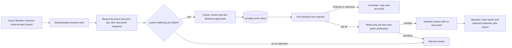

# Production Resolution Operator: Azure VM backup pilot

This is an operator-controlled path from a failed Azure VM backup alert to a verified new backup and an attached isolated restore drill. It composes the existing [Backup Resolution](backup-resolution.md), [Resolution Network](resolution-network.md), [Recovery Operator](recovery-operator.md) and [Service Delivery Cloud](service-delivery-cloud.md) modules. The code can call Azure CLI for read-only collection and one explicitly acknowledged `backup-now` write. The included tests use synthetic evidence and a fake Azure runner; **no customer tenant was accessed**.



## What is enforced

- The alert must be `Fired` and target the declared vault; the recipe and exact Azure VM scope are pinned in the case ledger. Duplicate alert IDs return the same case.
- Diagnosis records a scope-matched snapshot. A retry is possible only when the latest matching backup job failed, the fresh Azure account matches the tenant/subscription, the failed job has not changed, cause review is declared, both `workload-owner` and `backup-operator` approvals are declared, and the operator explicitly acknowledges a cloud write.
- A durable write intent is committed **before** invoking Azure. There is one intent per case. A timeout, ambiguous response, or process interruption must be reconciled against Azure before any further action; this workflow never issues a blind automatic second retry.
- Backup verification requires the returned job ID to complete and a new recovery point. A drill can be attached only after that verification, with the exact case scope, a later probe, and the newly verified recovery point. A passing attached drill may also be recorded against an active, matching Service Delivery Cloud pilot.
- The customer report shows backup and drill status. The local hash chain detects accidental case-history changes; it is not an externally trusted audit trail. Approval flags and restore/cleanup records are operator assertions, not authenticated signatures or independent cloud evidence.

## Pilot command path

Use the same private SQLite path for every command. Authenticate Azure CLI separately with an identity authorized for the exact subscription. The alert must be exported by an authenticated, trusted upstream route; this release does not expose a public webhook.

```bash
azure-msp-production-resolution --db /private/path/operator.sqlite3 open \
  --recipe examples/workcells/azure-vm-backup-resolution.json \
  --alert /private/path/azure-alert.json --scope /private/path/backup-scope.json

azure-msp-production-resolution --db /private/path/operator.sqlite3 diagnose CASE_ID \
  --acknowledge-authorized-read
```

Review the source job error, Azure health, vault configuration, and change context. The code identifies a retry candidate; it does not establish root cause. Only after cause review and the required approvals:

```bash
azure-msp-production-resolution --db /private/path/operator.sqlite3 retry CASE_ID \
  --approval workload-owner --approval backup-operator \
  --cause-reviewed --acknowledge-cloud-write

azure-msp-production-resolution --db /private/path/operator.sqlite3 verify CASE_ID \
  --acknowledge-authorized-read
```

If `retry` times out or returns an uncertain job ID, stop. Inspect Azure job history and the local `show` output. Do not clear the intent or repeat the command without a documented reconciliation procedure. `verify` can be repeated after a pending job completes; it performs reads only.

After an independently run isolated restore and a read-only application probe, attach the finalized drill. The restore evidence must name the new recovery point produced by this case. `--pilot-id` is optional and requires an active scoped customer pilot in the same database.

```bash
azure-msp-production-resolution --db /private/path/operator.sqlite3 attach-drill CASE_ID \
  --contract /private/path/drill-contract.json \
  --restore /private/path/restore-evidence.json \
  --probe /private/path/probe-result.json --pilot-id PILOT_ID

azure-msp-production-resolution --db /private/path/operator.sqlite3 show CASE_ID
```

The synthetic end-to-end path, including a simulated Azure timeout and duplicate-write prevention, is exercised by `tests/test_production_resolution.py`. `diagnose --snapshot` and `verify --after` accept private JSON for controlled replay; the normal commands perform live reads. The tool never performs a restore itself.

## Measurable first engagement

For one consenting customer, record alert-to-diagnosis and alert-to-verified-backup times, retry acceptance, new-point verification, drill success, operator minutes, repeat failures, Azure charges and customer fee. A billable managed service still requires authenticated alert delivery, real approver identity, durable job polling, a secure operator queue, reconciliation of uncertain writes, on-call coverage, protected customer data storage, and a signed service agreement. A verified backup alone is not a verified restore.
