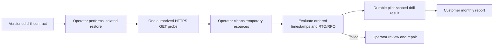

# Recovery Operator: application-level drill slice

Recovery Operator extends the replay-only [Recovery Assurance](recovery-assurance.md) evaluator and the [Service Delivery Cloud](service-delivery-cloud.md) pilot. It tests whether a restored application answers a specified read-only business assertion within its RTO and RPO. It does **not** provision a restore, fail over production, execute a write transaction, or independently verify that an operator's restore and cleanup assertions are true.



## Contract and result

The contract fixes the Azure VM scope, workload, isolated environment identifier, RTO/RPO thresholds, exact HTTPS probe URL, and one JSON assertion. The probe issues a single unauthenticated GET, disallows redirects, rejects URL credentials and query strings, caps the response at 64 KiB, and stores only its hash, status, latency and pass/fail result. No response body is written to the report. Use only a specifically authorized, non-sensitive endpoint. The current URL validation blocks local IP literals and `localhost`, but it does not defend against DNS rebinding; deploy the probe in a controlled network before using it as a hosted service.

Elapsed time is measured from drill start to the application probe. It is reported as actual RTO only if the transaction passes; otherwise actual RTO is unknown. RPO is the recovery point's age at drill start. Both durations use ceiling seconds so a fractional second cannot make a threshold pass. Evaluation also requires an isolated environment assertion, restore job identifier, and cleanup timestamp after the probe. A failed transaction, RTO, or RPO yields `failed`; malformed scope, sequence, isolation, or cleanup is rejected rather than treated as a completed drill.

## Synthetic replay

This command requires no Azure account or network access. The fixtures are fictional and prove only evaluation behavior.

```bash
azure-msp-recovery-operator evaluate \
  examples/recovery-operator-contract.synthetic.json \
  examples/recovery-operator-restore.synthetic.json \
  examples/recovery-operator-probe.synthetic.json \
  --output evidence/recovery-operator-report.json
```

For an authorized real drill, first conduct an isolated restore using the customer's approved Azure process and record the restore job and times. While the isolated application is running, issue the read-only probe:

```bash
azure-msp-recovery-operator probe customer-drill-contract.json \
  --acknowledge-authorized-probe --output evidence/customer-probe.json
```

After cleaning the temporary restore resources, add `cleanup_confirmed=true` and `cleanup_at` to the restore evidence. Then evaluate and optionally attach the result to an active Service Delivery Cloud pilot, using the **same** SQLite database:

```bash
azure-msp-recovery-operator evaluate customer-drill-contract.json \
  evidence/customer-restore.json evidence/customer-probe.json \
  --db evidence/service-delivery.sqlite3 --pilot-id PILOT_ID \
  --output evidence/customer-drill-report.json
```

The pilot scope must match tenant, subscription, resource group, vault and VM, and the probe must have occurred after pilot activation. Repeating the same result is idempotent. A failed drill creates an open local operator follow-up, which can be listed with `azure-msp-recovery-operator followups PILOT_ID --db evidence/service-delivery.sqlite3`. The customer monthly report includes workload, outcome, RTO, RPO, and probe time; raw probe response, restore evidence, operator labor and contribution estimates remain outside that report.

## Production release gates

Before billing for automated drills, add a separately permissioned Azure restore adapter, real isolation proof, verified Azure job observation, application-specific transactional checks, cleanup verification, cost metering, retries and timeouts, customer consent, tenant-scoped identity, network egress policy and operational alerting. A signed operator assertion is still weaker than independently collected cloud evidence. The first paid pilot should measure successful drills, false failures, median and p95 RTO, cleanup completion, operator minutes and drill cloud cost across repeated runs.
