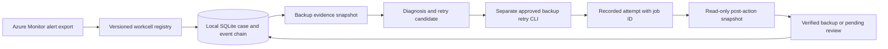

# A2Z Resolution Network: first workcell runner

This release packages [Backup Resolution](backup-resolution.md) as a versioned workcell and gives it a local, durable case lifecycle. An Azure Monitor common-alert payload can be imported from a file; duplicate alert IDs map to the same case. Diagnosis, the separate approved retry command, and post-action verification are recorded as case events in SQLite. The event hashes detect accidental changes to the local history, but the database is **not** an independently trusted audit log. No public webhook, hosted tenant service or live customer incident is included.



## Reproduce the complete synthetic case

Install with `python -m pip install -e .`, or prefix the commands with `PYTHONPATH=src python -m azure_msp.resolution_network_cli`. Keep the database outside the repository.

```bash
python -c 'import json; from pathlib import Path; data=json.loads(Path("examples/backup-resolution-before.synthetic.json").read_text()); Path("/tmp/synthetic-backup-scope.json").write_text(json.dumps(data["scope"]))'

azure-msp-resolution-network ingest --db /private/path/cases.sqlite \
  --recipe examples/workcells/azure-vm-backup-resolution.json \
  --alert examples/backup-alert.synthetic.json \
  --scope /tmp/synthetic-backup-scope.json
```

The command prints a `case_id`. Substitute that value in the following commands.

```bash
azure-msp-resolution-network diagnose --db /private/path/cases.sqlite \
  --case-id case-REPLACE \
  --snapshot examples/backup-resolution-before.synthetic.json

azure-msp-resolution-network record-attempt --db /private/path/cases.sqlite \
  --case-id case-REPLACE \
  --attempt examples/backup-resolution-attempt.synthetic.json

azure-msp-resolution-network verify --db /private/path/cases.sqlite \
  --case-id case-REPLACE \
  --after examples/backup-resolution-after.synthetic.json

azure-msp-resolution-network show --db /private/path/cases.sqlite \
  --case-id case-REPLACE --output /private/path/case.json
```

The case moves through `received → diagnosed → awaiting_result → verified`. An incomplete post-action snapshot leaves it at `awaiting_result` so it can be checked again. The retry is performed by `azure-msp-backup-resolution retry` from the [backup runbook](backup-resolution.md); this runner only records its output. It does not independently authenticate the two approval strings in that output.

## Package and evidence contracts

The recipe file pins an adapter, semantic version, alert schema and target resource type. The current registry allows only the implemented `azure_vm_backup_v1` adapter; a recipe cannot name an arbitrary shell command. Alert ingestion requires a `Fired` Azure Monitor common-alert payload whose target ID is inside the exact declared Recovery Services vault. Its `(workcell_id, alert_id)` pair is unique in the database. Each case snapshots its recipe version at creation. Diagnosis and attempt must reference the same scope, failed job and evidence digest; verification requires the same scope and a checked Azure account. Repeating the same alert or evidence does not create a second case event.

Azure Monitor can deliver alerts to action groups and webhooks, but this release accepts a **file export only**. An internet-facing intake needs Entra-authenticated delivery, replay protection, rate limits, tenant resolution and operational monitoring before it can serve a customer. [Azure Monitor action groups](https://learn.microsoft.com/en-us/azure/azure-monitor/alerts/action-groups) documents the delivery mechanisms.

## Production and commercial path

Start with one consented MSP/customer pilot and the backup workcell. Measure alert-to-diagnosis time, verified backup rate, manual minutes, recurrence, action failures and cost per verified backup. The next increments are authenticated alert intake, durable job polling, real approver identity, a tested restore drill, tenant-scoped access and on-call escalation. Only then add a second workcell for InferenceFleet rollout recovery.

The OSS package can publish the recipe contract, adapters, local runner and synthetic tests. A commercial service can operate multi-tenant intake, authenticated approvals, support, customer integrations and partner billing. Those commercial capabilities are **design boundaries**, not current features or revenue claims.
