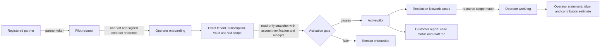

# Service Delivery Cloud: first production-shaped slice

This module turns the Azure VM backup Resolution Network into a sellable **one-VM managed-service pilot workflow**. It is a local operator tool, not a hosted portal or a live MSP deployment. Its first buyer-facing result is a scoped monthly case report and draft fixed-fee charge. No invoice or payment is created.



## Operating contract

1. Register a partner with the existing `azure-msp-partner-cloud register-partner` command. Keep its high-entropy token outside the repository.
2. The partner submits a one-VM request. A partner can list only its own requests.
3. An operator enters a signed contract reference, exact Azure VM backup scope, fixed monthly fee, hourly operator cost, and a separate customer token. The contract reference is an operator assertion; the system does not validate a signature.
4. Activation requires a backup snapshot with the same scope, `source_status=observed`, `account_verified=true`, a backup item, and four observed receipts with the same tenant and subscription. The digest is stored. **The submitted JSON can still be forged by an operator.** For a real pilot, collect it with the repository's authorized read-only Azure CLI adapter and preserve the raw source separately. This gate does not prove Lighthouse delegation or restoration success.
5. Resolution Network cases are joined only when tenant, subscription, resource group, vault, and VM all match. Operator labor cannot be recorded against another VM. The customer report exposes case ID, state, creation time and backup result, without raw snapshots, event details, approval data, labor cost, or margin.
6. The operator statement computes direct labor as `round_half_up(minutes × hourly_cost / 60)` in cents and estimated contribution as fixed fee minus direct labor. It excludes cloud usage, overhead, tax, credits, chargebacks and proration.

## Local command path

The examples below are a command map, not a claim of live customer operation. Set `AZURE_MSP_PARTNER_TOKEN` and `AZURE_MSP_CUSTOMER_TOKEN` to independent random values of at least 32 characters. Use the same `--db` path throughout. Do not paste tokens into command arguments or commit the SQLite file.

```bash
azure-msp-service-delivery --db evidence/service-delivery.sqlite3 request partner-a customer-a --vm-count 1
azure-msp-service-delivery --db evidence/service-delivery.sqlite3 requests partner-a
azure-msp-service-delivery --db evidence/service-delivery.sqlite3 onboard REQUEST_ID \
  examples/backup-resolution-scope.template.json --contract-ref signed-msa-1 \
  --monthly-fee-usd 1200.00 --hourly-cost-usd 90.00
azure-msp-service-delivery --db evidence/service-delivery.sqlite3 activate PILOT_ID \
  evidence/authorized-backup-snapshot.json
azure-msp-service-delivery --db evidence/service-delivery.sqlite3 work PILOT_ID CASE_ID \
  --minutes 90 --note 'Reviewed backup failure'
azure-msp-service-delivery --db evidence/service-delivery.sqlite3 report PILOT_ID 2026-09
azure-msp-service-delivery --db evidence/service-delivery.sqlite3 statement PILOT_ID 2026-09
```

The template scope must be edited to the pilot's authorized identifiers before onboarding. Cases come from `azure-msp-resolution-network`; the commands must use the same SQLite file. The customer token is checked by the `report` command; `statement` is intentionally operator-only and should run solely on an access-controlled host. SQLite file permissions, secret storage, identity federation, network isolation, retention, backups, audit export, metering reconciliation and contract enforcement belong in the hosted commercial implementation before external access.

## Release gates

| Gate | Evidence required |
| --- | --- |
| First consented pilot | Signed scope and contract, authorized Azure read, customer-approved data handling, recovery runbook |
| Buyer-facing service | Authenticated portal, tenant isolation tests, incident ownership, support hours, backup verification and restore drill |
| Billable production | Contracted price, tax/proration terms, invoice integration, cost allocation, dispute workflow, reconciliation |
| Repeatable channel | At least two independent customers, service-level performance, measured labor/case, churn and contribution margin |

This repo provides the local workflow and calculations. It does not assert real-world revenue, a deployed Azure workload, backup restorability or a production-ready commercial service.
